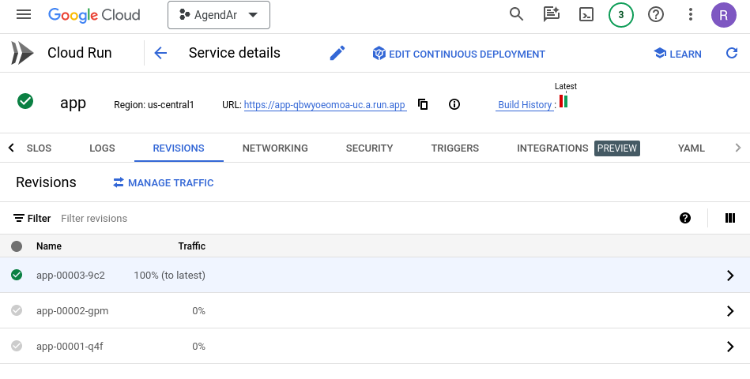
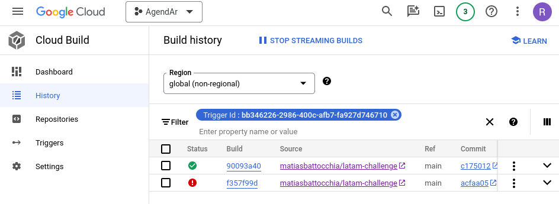

# Notes

## Part 1

### Data

The dataset is imbalanced. The classes are:
* 0 (81.6%) — On time
* 1 (18.4%) — Delayed

### Metric

**F1-score** is the harmonic mean of precision and recall, where the relative contribution of each one to the score are equal.
F1-score reaches its best value at 1 and worst score at 0.

**Precision** gives us an idea of the proportion of how many delayed flights (TP) we correctly classified among all the fligts we classified as delayed (TP + FP).
**Recall** tells us about how many of the actual delayed flights (TP) we retrieved (TP + FN).

Since we are trying to find an equal balance between precision and recall, F1-score is useful when we are working with a non-uniform distribution of class labels.

### Rationale for choosing a model

From the exploration notebook:
> the model to be productive must be the one that is trained with the top 10 features and class balancing

I can choose between:
* 6.b.i. XGBoost with Feature Importance and with Balance — F1-score for the delayed class: **0.37**
* 6.b.iii. Logistic Regression with Feature Importante and with Balance — F1-score for the delayed class: **0.36**

XGBoost has a slightly advantage. Nonetheless the logistic model, simple and lightweigth, will yield faster inference times. **I prefered the second one.**

### Implementation

`target_column` argument from `preprocess()` could have been a boolean. I've not used its value to set the target column name, which is taken from a class variable, as the required feature column names.

### Tests

I introduced some big modifications to the test suit. There is a new file `test_performance.py` that holds the original `test_model_fit` from `test_model.py` (renamed to `test_model_performance`). This one is an
integration test which probes `DelayModel` against baseline metrics.

`test_model.py` was fully ported to `pytest` and comprises unit tests that check the implementation of `DelayModel`. Here I used mocked data / fixtures whenever necessary to avoid test dependencies. Originally `test_model_predict` depended on `test_model_fit` which un turn depended on `test_model_preprocess_for_training`. These couplings were the reason that motivated my refactor.

## Part 2

**Note**: I would have used [Deserve](https://github.com/matiasbattocchia/deserve) instead of FastAPI.

Even though I used a virtualenv and installed packages with versions from the requirements files, I had to bump the FastAPI version and install `httpx` due some obscure errors during `make test-api`. My Python version is 3.10.

Added methods to `DelayModel` to `save` and `load` trained models, in order for the app to load a working model. I mocked the model in `test_api.py`, though.

I had to patch DelayModel preprocess to take into account one-hot encoding for inference, since fit does not learns the encoding
categories used for training the model. There is a scikit Transformation for this task, which is more appropiate than Pandas `get_dummies`, plus it handles unknown categories. But the quick fix was good enough.

I implemented Pydantic models to validate input values. In my opinion `test_should_failed_unkown_column_3` should not fail:
an unknown operator could be acceptable, but I did not touch it.

I modified some test input values, please see the inline comments. I also changed expected error codes due validation errors from 400 to 422, as they are more precise.

## Part 3

I removed the train test split from `test_performance.py`. The original implementation trained with the whole dateset and tested with a subset of it. For the sake of testing that the model can do well against the training data, the test split is not needed at all. Of course, I do not expect to get any measurement of the actual performance in this step.

I created the `train.py` script. The deploy script trains the model and then stores it in a `delay_model.pkl` pickle file. The script also produces a report, which is saved as a `report.json` json file. Thinking ahead, **these two files should be tracked / versioned**. I modified `api.py` to load the saved model.

Now that `api.py` imports the model from `model.py`, I had to bump the `pytest` version and to add a `pytest.ini` file to support modules which import local modules.

I deployed the containerized app to Google Cloud Run.

**Service URL**: https://app-qbwyoeomoa-uc.a.run.app

### Useful commands

#### Local

```
docker build -t latam .
docker run --rm -it -p 80:8888 latam
curl -X POST localhost:8080/predict -H 'Content-Type: application/json' -d '{"flights": [{"OPERA": "Aerolineas Argentinas", "TIPOVUELO": "N","MES": 3}]}'
```

#### Google Cloud

```
docker tag latam us-central1-docker.pkg.dev/agendar-391402/latam-challenge/app
docker push us-central1-docker.pkg.dev/agendar-391402/latam-challenge/app
curl -X POST https://app-qbwyoeomoa-uc.a.run.app/predict -H 'Content-Type: application/json' -d '{"flights": [{"OPERA": "Grupo LATAM", "TIPOVUELO": "N","MES": 3}]}'
```

## Part 4

I implemented the continuous integration workflow at `ci.yml`. This workflow runs the model and API tests from parts 1 and 2.

On the contrary, I did not implement `cd.yml` for the continuous deployment workflow. Instead, I used the Cloud Run integration with GitHub, which did the hard work for me. A Cloud Build process gets triggered on commit on the `main` branch. 



